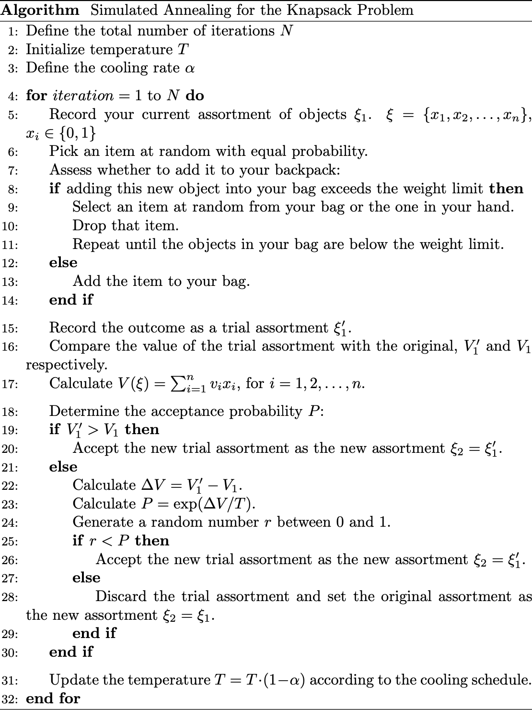
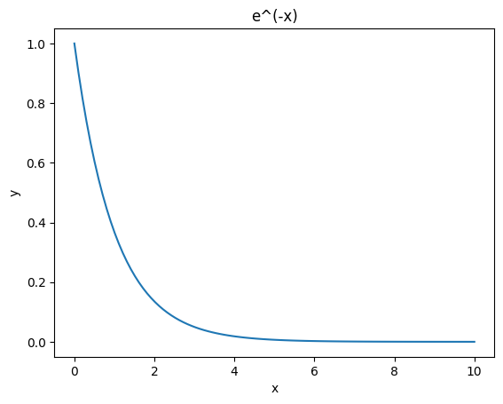
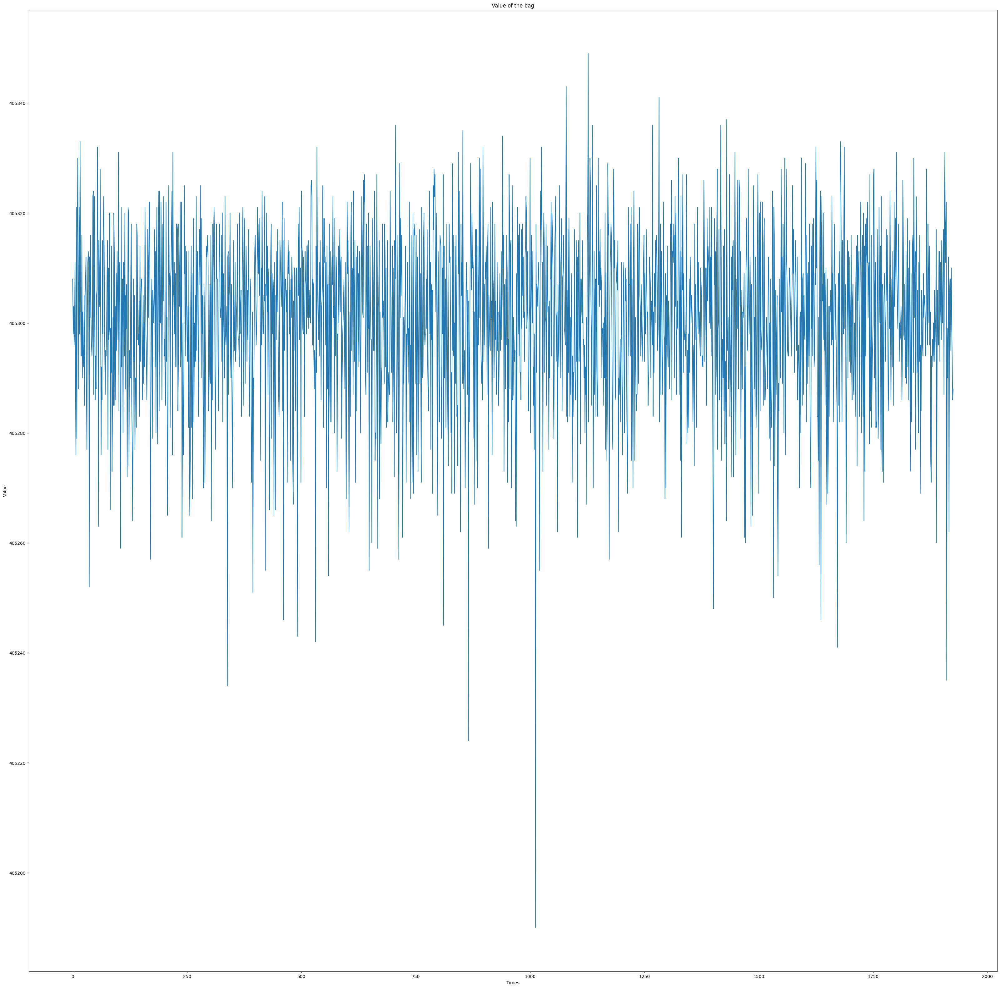
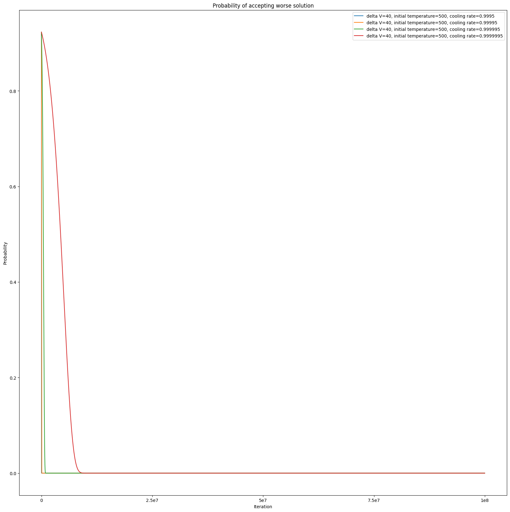
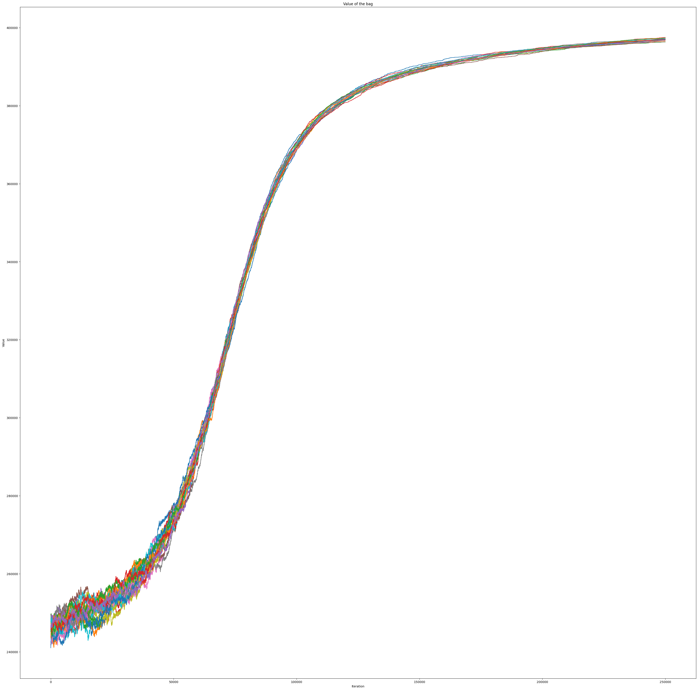
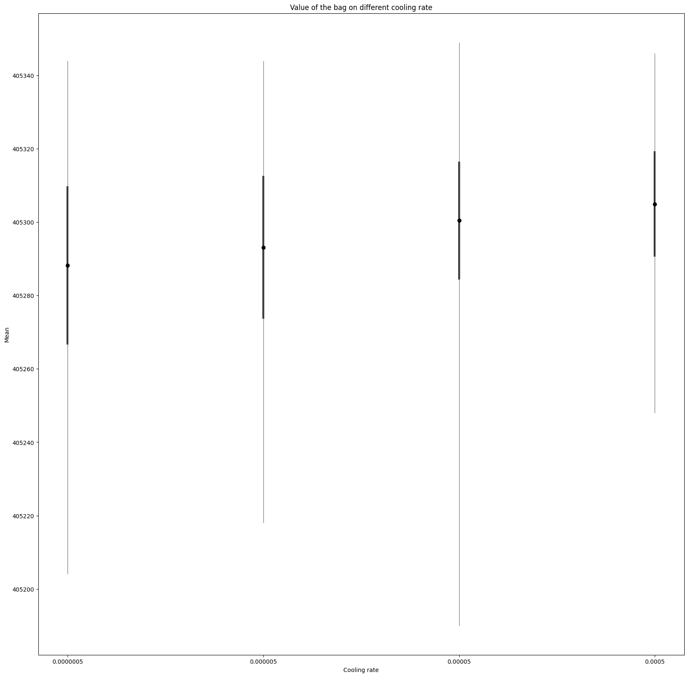
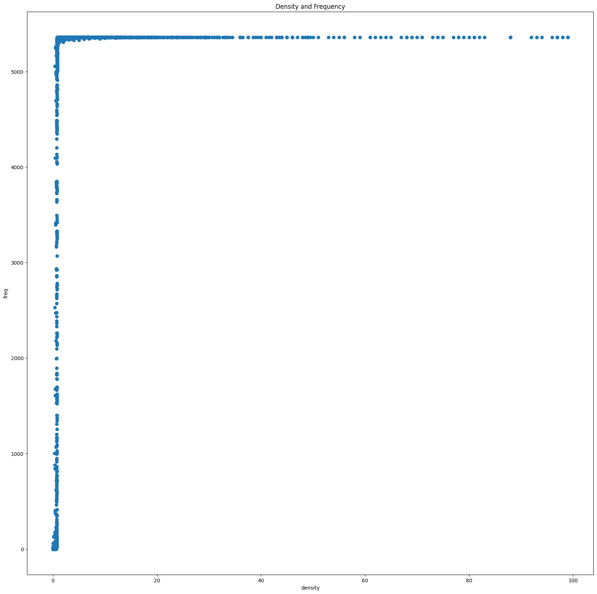

# Simulated Annealing for the Knapsack Problem

### Introduction
   
   - **Probabilistic Technique**: Simulated Annealing (SA) employs a probabilistic approach to approximate the global optimum of a function.
   - **Optimization in Large Spaces**: It is particularly suited for optimization problems characterized by large search spaces and multiple local optima.
   - **Metaheuristic Origin**: The technique is inspired by the metallurgical process of annealing, which involves heating and controlled cooling to improve material properties.
   - **Applicability**: SA is favored in scenarios where the search space is discrete, and obtaining a near-optimal global solution is more important than identifying an exact local optimum quickly.
   - **Versatility Across Domains**: Its utility is proven in various fields, including solutions for the traveling salesman problem and job-shop scheduling, underscoring its ability to tackle complex optimization issues.
   - **Alternative to Exact Algorithms**: SA provides an effective alternative in situations where exact algorithms may fail or be impractical, by offering viable approximate solutions.

---

### Pseudocode

   

 

- In line 23, we don't have to worry about the probability being larger than one because $\Delta V$ is a negative number, and the exponential of a negative number is always less than one.

   
---

### Result and Discover

   | Initial Temperature | Cooling rate | Times | Max Value | Min Value | Mean       | Standard Deviation |
   | ------------------- | ------------ | ----- | --------- | --------- | ---------- | ------------------ |
   | 500                 | 0.005        | 1214  | 405346    | 405248    | 405305.096 | 14.134             |
   | 500                 | 0.0005       | 2119  | 405349    | 405190    | 405300.296 | 16.091             |
   | 500                 | 0.00005      | 1339  | 405344    | 405218    | 405293.253 | 19.440             |
   | 500                 | 0.000005     | 1336  | 405344    | 405204    | 405288.124 | 21.369             |
   - Best Value: 405349

      

   - Because using Simulated Annealing, the acceptance probability is higher at the first, and lower in the end.

      

   - As the result, the value is changeable at the first and stable in the end. The figure is the experiment under temperature=1000 and cooling rate=0.0005 for 25 times.

      

   - The error bar under different cooling rate. The standard deviation is smaller when cooling rate smaller.

      

   - The item which have larger density be selected frequently.

      

   - In the beginning, it will select items randomly. In the middle, it will choose many items for the bag. Finally, it will remove some items and keep those with higher density. (The leftmost and topmost pixel represents item id=0, with id=1 to its right, id=2, and so on. The pixel below it represents id=101, id=201, and so on. A black dot means the item is in the bag. A white one means the item is not in the bag.)

      

      

      

   - The color bar indicates the number of times an item is added or removed from the bag. For instance, a value of 15 means the item has been added to or removed from the bag 15 times. This shows that by using SA, most of items are added and removed multiple times to test whether it is suitable. But some items are not be selected during the whole program.

   - I found that some items are frequently selected and then removed from the bag in each experiment. For example, id=6674 and id=9525 are selected and removed more than 100 times in every experiment. I think this is because their weight is small, so they can be added to the bag easily, but they have no value, so they are also removed easily. I also found that there are 96 items that have no value and 115 items that have value but no weight. Thus, I think we can try to ignore the items with no value and always add the items that have value but no weight to maximize the bag's value.

      

---

### Reference

   [Overleaf, Online LaTeX Editor](https://www.overleaf.com/read/kgcmkzqppkjm#91957a)

   [Simulated annealing - Wikipedia](https://en.wikipedia.org/wiki/Simulated_annealing)

   [【数之道17】金属冷却处理中隐藏的智慧-模拟退火优化算法](https://www.youtube.com/watch?v=P4p-YgidpZ4)

   [Wustl](https://www.math.wustl.edu/~feres/Math350Fall2012/Projects/mathproj09.pdf)

